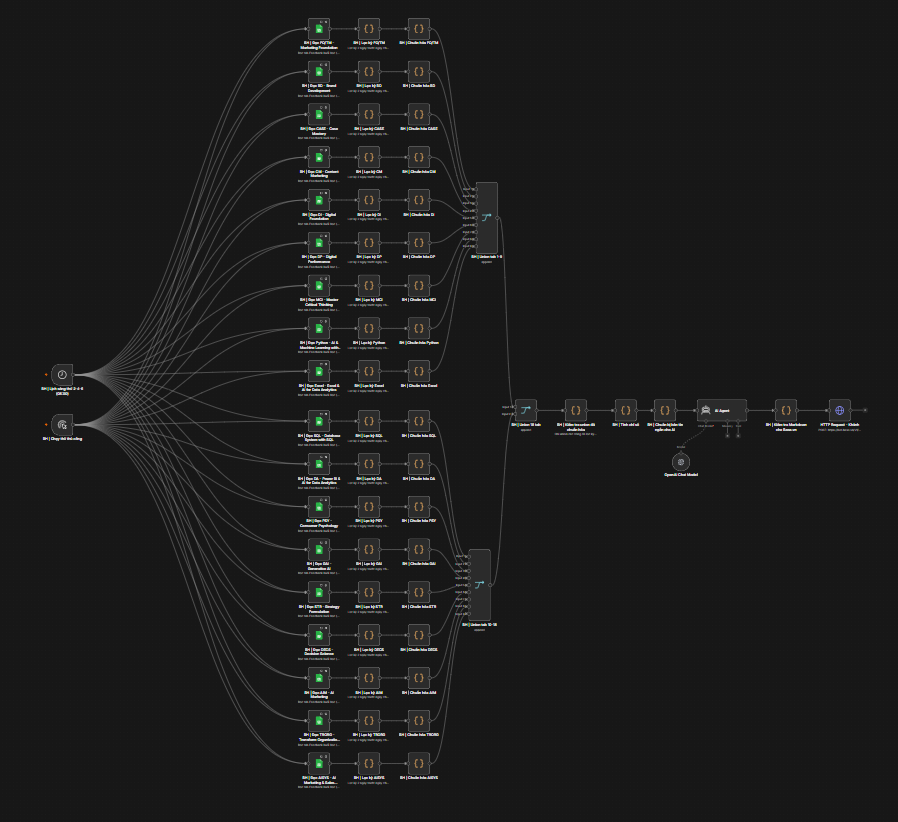
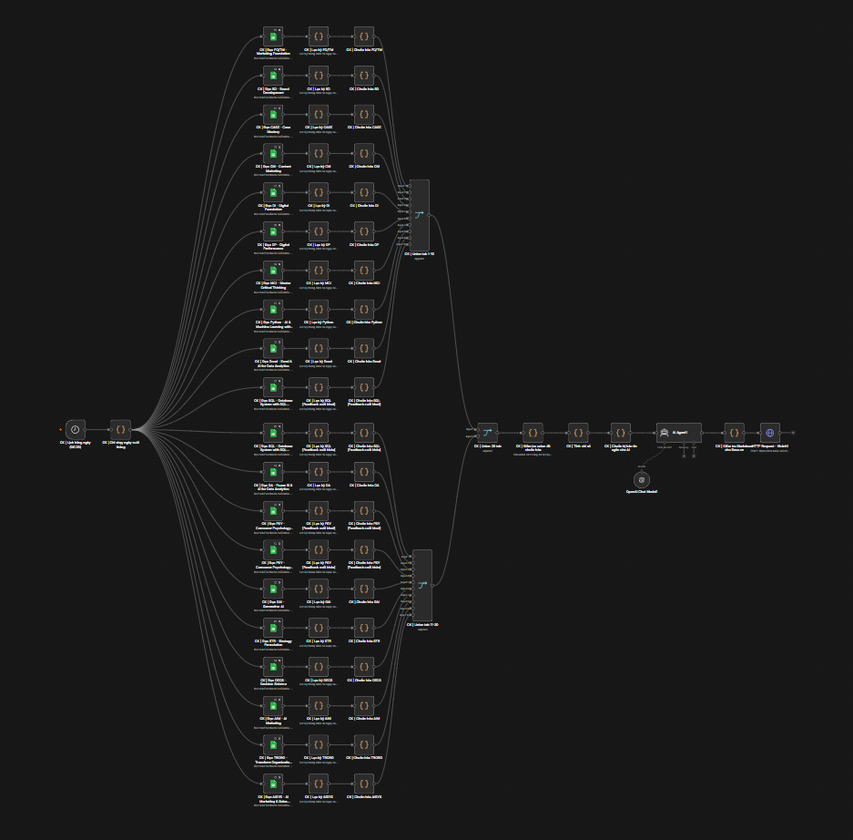

# Feedback Brief Agent

Workflow [n8n](https://n8n.io/) tổng hợp phản hồi học viên Tomorrow Marketers từ Google Sheets, tính chỉ số bằng Code node, dùng AI Agent viết bản tin tiếng Việt và gửi qua webhook Base.vn. Repository chứa **bản workflow hiện tại** và mã nguồn tham khảo cho các Code node; file JSON là bản để import vào n8n.

## Hai luồng trong workflow

### 1. Phản hồi buổi học (`BH`)



- Schedule Trigger: **08:00 thứ Hai, Tư, Sáu** (`0 8 * * 1,3,5`). Có thêm Manual Trigger để chạy thử.
- Đọc **18 tab buổi học** từ 18 Google Sheets. Ngay sau mỗi tab, Code node lọc phản hồi của **hai ngày lịch trước ngày chạy** và chuẩn hóa tên cột, điểm, nhận xét.
- Gộp 18 nguồn qua các Merge node, kiểm tra số nguồn và lỗi, rồi khử bản ghi trùng theo nguồn, tab và dòng.
- Tính tỷ lệ điểm **4–5/5** cho mức đáp ứng kỳ vọng, mức hiểu bài, khả năng truyền đạt và tỷ lệ chung trên số lượt chấm hợp lệ. Phản hồi có **bất kỳ tiêu chí nào ≤ 3/5** được đưa vào danh sách cần chú ý.
- Rút gọn dữ liệu cho AI Agent, tạo bản tin cho CS, kiểm tra Markdown và gửi tới webhook Base.vn.

### 2. Phản hồi cuối khóa (`CK`)



- Schedule Trigger được đặt **08:00 hằng ngày** (`0 0 8 * * *`), sau đó đi qua Code node kiểm tra ngày cuối tháng.
- Đọc **20 tab cuối khóa** từ cùng 18 Google Sheets. SQL và PSY mỗi khóa có hai tab cuối khóa. Mỗi tab được lọc theo **tháng hiện tại** và chuẩn hóa trước khi gộp.
- Kiểm tra đủ nguồn, khử trùng lặp, tính phân bổ điểm **9–10 / 7–8 / 0–6** cho mức sẵn sàng giới thiệu, hài lòng với CS và trải nghiệm TM; tính **NPS = % nhóm 9–10 − % nhóm 0–6**.
- Tổng hợp câu trả lời mở và nhu cầu học tiếp, đưa dữ liệu gọn vào AI Agent, định dạng bản tin và gửi tới webhook Base.vn.

Ở cả hai luồng, phép lọc và tính số liệu nằm trong Code node. AI Agent diễn giải dữ liệu đã tính và viết bản tin; hai `OpenAI Chat Model` được nối với các Agent. Các node `HTTP Request - Khánh` là bước gửi cuối cùng và **có thể gửi tin thật** khi được thực thi.

## Cấu trúc repository

```text
.
├── Feedback Brief Agent.json     # Workflow n8n để import (138 node)
├── README.md
├── assets/
│   ├── workflow-buoi-hoc.png     # Ảnh luồng buổi học
│   └── workflow-cuoi-khoa.png    # Ảnh luồng cuối khóa
├── workflow-src/                 # Mã nguồn tham khảo cho Code node
├── test-workflow.js              # Kiểm thử cấu trúc và logic bằng dữ liệu mẫu
├── build-workflow.js             # Bộ tạo workflow cũ; có chặn ghi đè JSON hiện tại
├── patch-current-workflow.js     # Script chuyển đổi một lần, không chạy lại
└── update-agent-briefs.js        # Script cập nhật một lần, không chạy lại
```

`workflow-src/` giúp đọc và bảo trì logic, nhưng **JSON là bản workflow đang được dùng**. Các script chuyển đổi ghi trực tiếp vào JSON và không cần chạy để import hoặc kiểm thử. `build-workflow.js` chủ động từ chối ghi đè bản JSON hiện tại có AI Agent/webhook.

## Import và kiểm tra

1. Trong n8n, chọn **Import from File** và tải `Feedback Brief Agent.json`.
2. Gắn lại Google Sheets OAuth credential cho các node đọc nếu credential ID trong file không tồn tại trên instance của bạn; bảo đảm tài khoản đọc được 18 Sheets và đúng các tab.
3. Kiểm tra credential của hai OpenAI Chat Model, model đang chọn và kết nối tới AI Agent.
4. Kiểm tra URL, bot và nhóm nhận ở hai HTTP Request Base.vn. Dữ liệu trong JSON có **URL webhook thật** theo cấu hình hiện tại.
5. Kiểm tra lịch chạy, múi giờ của **instance/workflow n8n**, chạy thử bằng dữ liệu phù hợp với kỳ hiện tại và xem đầu ra trước node HTTP Request. Chỉ bật chạy tự động sau khi đã xác nhận bản tin và người nhận.

### Trạng thái quan trọng của bản JSON này

- File có `active: true`. Việc workflow có thực sự chạy sau import còn phụ thuộc trạng thái trên instance n8n; hãy kiểm tra trực tiếp trong giao diện.
- `settings` của JSON **không khai báo timezone**. Logic lọc ngày dùng `Asia/Ho_Chi_Minh`, nhưng giờ Schedule Trigger cần được đối chiếu với timezone cấu hình trong n8n.
- Node `CK | Chỉ chạy ngày cuối tháng` hiện có **`TEST_MODE = true`** và `TEST_DATE = '2026-08-31'`. Vì ngày thử này là ngày cuối tháng, cổng sẽ cho nhánh CK đi tiếp ở mỗi lần lịch 08:00 chạy. Các node lọc phía sau vẫn lấy phản hồi của **tháng hiện tại**. Cần tắt test mode trong n8n trước khi cho lịch CK vận hành chính thức.
- Hai webhook là điểm gửi thật. Không dùng **Execute workflow** toàn nhánh khi chưa muốn gửi bản tin.

## Kiểm thử cục bộ

Yêu cầu Node.js. Không cần cài package:

```bash
node test-workflow.js
```

Test hiện kiểm tra 38 chuỗi đọc → lọc kỳ → chuẩn hóa, cấu trúc nối node, các phép tính mẫu, đường đi qua AI Agent, định dạng Markdown và việc giữ URL webhook. Đây là kiểm thử bằng dữ liệu mô phỏng; **không** xác nhận quyền Google Sheets, nội dung thực tế, giờ chạy n8n hay việc gửi Base.vn.

## Lưu ý vận hành

- File JSON chứa ID nguồn Google Sheets, tham chiếu credential và URL webhook Base.vn. Repository nên được cấp quyền truy cập phù hợp với dữ liệu này. Không commit OAuth token, API key, execution data hoặc phản hồi học viên.
- Các tab có thể thay đổi tiêu đề cột hoặc định dạng ngày. Khi vận hành, kiểm tra cảnh báo Timestamp, lỗi ánh xạ và số nguồn đã đọc; workflow dừng khi có lỗi nguồn/cột thay vì âm thầm xuất báo cáo thiếu.
- Workflow chưa có cơ chế lưu trạng thái để chống **gửi lại cùng kỳ** khi chạy thủ công hoặc chạy lại sau lỗi. Cần kiểm tra lịch sử execution trước khi thực hiện lại.
- Số phản hồi lớn có thể làm bản tin AI dài; cần theo dõi giới hạn đầu vào và độ dài tin Base.vn khi triển khai thực tế.
